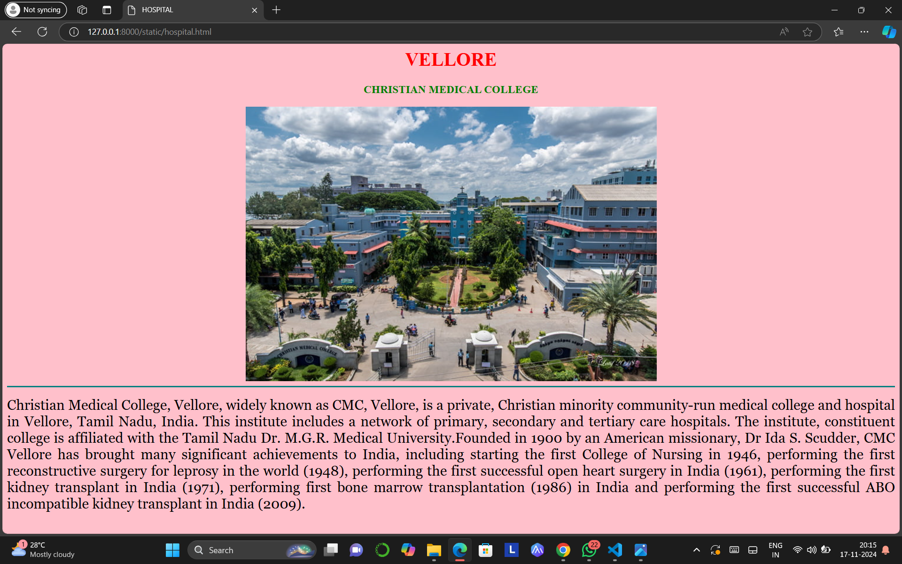

# Ex04 Places Around Me
## Date: 17-11-2024

## AIM
To develop a website to display details about the places around my house.

## DESIGN STEPS

### STEP 1
Create a Django admin interface.

### STEP 2
Download your city map from Google.

### STEP 3
Using ```<map>``` tag name the map.

### STEP 4
Create clickable regions in the image using ```<area>``` tag.

### STEP 5
Write HTML programs for all the regions identified.

### STEP 6
Execute the programs and publish them.

## CODE
```
map.html

<html>
    <head>
        <title>
            My City
        </title>
    </head>
    <body>
        <h1 align="center">
            <font color="red"><b>VELLORE</b></font>
        </h1>
        <h3 align="center">
            <font color="darkgreen"><b>DHANUSHKUMAR S   ~ [24901013]</b></font>
        </h3>
        <center>
            

<map name="MY CITY">
    <area target="" alt="Vellore Fort" title="Vellore Fort" href="fort.html" coords="537,339,719,367" shape="rect">
    <area target="" alt="Christian Medical Hospital" title="Christian Medical Hospital" href="hospital.html" coords="547,262,688,300" shape="rect">
    <area target="" alt="The Vellore Kitchen" title="The Vellore Kitchen" href="hotel.html" coords="557,106,719,150" shape="rect">
    <area target="" alt="Cup and Saucer Waterfalls" title="Cup and Saucer Waterfalls" href="falls.html" coords="1045,155,1168,217" shape="rect">
    <area target="" alt="Royal Palace Mandapam" title="Royal Palace Mandapam" href="mandapam.html" coords="137,286,327,332" shape="rect">
</map>
        </center>   
       
        
    </body>
</html>

fort.html

<html>
    <head>
        <title>
            VELLORE FORT
        </title>
    </head>
    <body bgcolor="yellow">
        <h1 align="center">
            <font color="red"><b>VELLORE</b></font>

        </h1>
        <h3 align="center">
            <font color="black"><b>VELLORE FORT</b></font>
        </h3>
        <center>
            
       <hr size="3" color="light brown">
       <p align="justify">
        <font face="Georgia" size="5">
            Vellore Fort is a large 16th-century fort in the center of Vellore city, 
            in the state of Tamil Nadu, India. It was built by Vijayanagara kings. The fort was at one time the headquarters of the Aravidu Dynasty of the Vijayanagara Empire.
            The fort has grand ramparts and wide moat.

            The fort's ownership passed from Vijayanagara kings, to the Bijapur sultans, to the Marathas, 
            to the Carnatic Nawabs and finally to the British, who held the fort until India gained independence. 
            The Indian government maintains the fort with the Archaeological Department. During British rule, 
            the Tipu Sultan's family and the last king of Sri Lanka, Sri Vikrama Rajasinha were held as prisoners in the fort. 
            The fort houses the Jalakanteswarar Hindu temple, the Christian St. John's Church and a Muslim mosque, 
            of which the Jalakanteswarar Temple is famous for its magnificent carvings. The first significant military rebellion against 
            British rule erupted at this fort in 1806, and it is also a witness to the massacre of the Vijayanagara royal family of Sriranga Raya.
        </font>
       </p>
    </body>
</html>

hospital.html

<html>
    <head>
        <title>
            HOSPITAL
        </title>
    </head>
    <body bgcolor="pink">
        <h1 align="center">
            <font color="red"><b>VELLORE</b></font>

        </h1>
        <h3 align="center">
            <font color="green"><b>CHRISTIAN MEDICAL COLLEGE</b></font>
        </h3>
        <center>
            
       <hr size="3" color="teal">
       <p align="justify" >
        <font face="Georgia" size="5">
            Christian Medical College, Vellore, widely known as CMC, Vellore, is a private, Christian minority community-run medical
             college and hospital in Vellore, Tamil Nadu, India. This institute includes a network of primary, secondary and tertiary 
             care hospitals.

            The institute, constituent college is affiliated with the Tamil Nadu Dr. M.G.R. Medical University.Founded in 1900 by 
            an American missionary, Dr Ida S. Scudder, CMC Vellore has brought many significant achievements to India, including 
            starting the first College of Nursing in 1946, performing the first reconstructive surgery for leprosy in the world (1948),
             performing the first successful open heart surgery in India (1961), performing the first kidney transplant in India (1971),
              performing first bone marrow transplantation (1986) in India and performing the first successful ABO incompatible kidney 
              transplant in India (2009).
        </font>
       </p>
    </body>
</html>

hotel.html

<html>
    <head>
        <title>
            HOTEL
        </title>
    </head>
    <body bgcolor="orange">
        <h1 align="center">
            <font color="red"><b>VELLORE</b></font>

        </h1>
        <h3 align="center">
            <font color="navy"><b>THE VELLORE KITCHEN</b></font>
        </h3>
        <center>
            
       <hr size="3" color="teal">
       <p align="justify" >
        <font face="Georgia" size="5">
            The Vellore Kitchen (TVK) has professional Chefs, who have innate love for cooking and have worked and gained experience in the star hotels. 
            The Vellore Kitchen is one of the expertises in the art of cooking and dining at TVK is an experience you'll want to share with everyone, 
            as the taste, texture, color, odor and presentation are astonishingly best, one could experience. It provides South Indian, North Indian, 
            Chinese and Continental food varieties at one roof. TVK is a multi-cuisine restaurant and a right destination for the Non-vegetarian food lovers.
        </font>
       </p>
    </body>
</html>

falls.html

<html>
    <head>
        <title>
            WATERFALLS
        </title>
    </head>
    <body bgcolor="arctic">
        <h1 align="center">
            <font color="red"><b>VELLORE</b></font>

        </h1>
        <h3 align="center">
            <font color="darkgreen"><b>CUP & SAUCER WATERFALLS</b></font>
        </h3>
        <center>
            
       <hr size="3" color="teal">
       <p align="justify" >
        <font face="Georgia" size="5">
           Cup and Saucer fall is located in the Sathuvachari district of Vellore, this place is perfect for spending a quiet and serene holiday. 
           Ensconced by thick trees and bushes, the beauty it beholds is worth watching. 
           The name of this waterfall is attributed to its unique shape that appears as if a cup of water is pouring its contents into a massive saucer.

           The gorgeous site can be best enjoyed from atop the hill. To reach the top of the hill, take an exciting and adventurous trek through the lush green forests surrounding the fall
        </font>
       </p>
    </body>
</html>

mandapam.html

<html>
    <head>
        <title>
            MANDAPAM
        </title>
    </head>
    <body bgcolor="brown">
        <h1 align="center">
            <font color="red"><b>VELLORE</b></font>

        </h1>
        <h3 align="center">
            <font color="yellow"><b>ROYAL PALACE MANDAPAM</b></font>
        </h3>
        <center>
            
       <hr size="3" color="teal">
       <p align="justify" >
        <font face="Georgia" size="5">
            Royal Palace Kalyana Mandapam has been serving the community for past 22 years as a leading Banquet Halls in Vellore.
            Convinently located near Konavattam,this banquet hall blends sophistication and comfort,making it an ideal choice for spacial events.
            Established in 2002,rated 4.9 stars based on 3k+ reviews, Royal Palace Kalyana Mandapam has earned a reputation for making
            every occation memorable.
           
        </font>
       </p>
    </body>
</html>


```


## OUTPUT





## RESULT
The program for implementing image maps using HTML is executed successfully.
